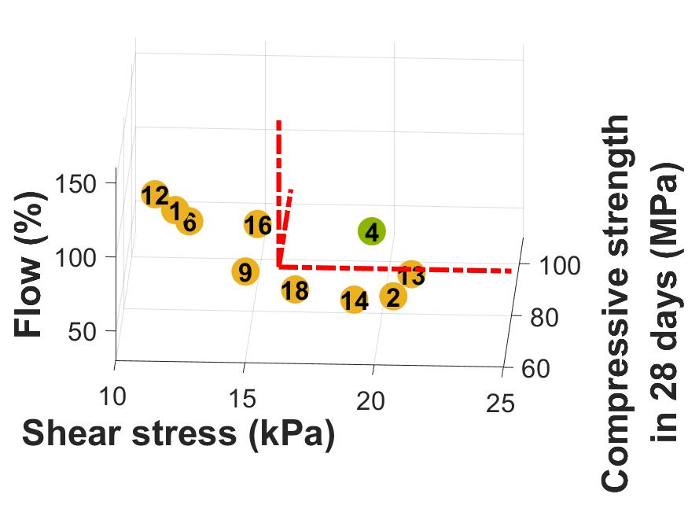
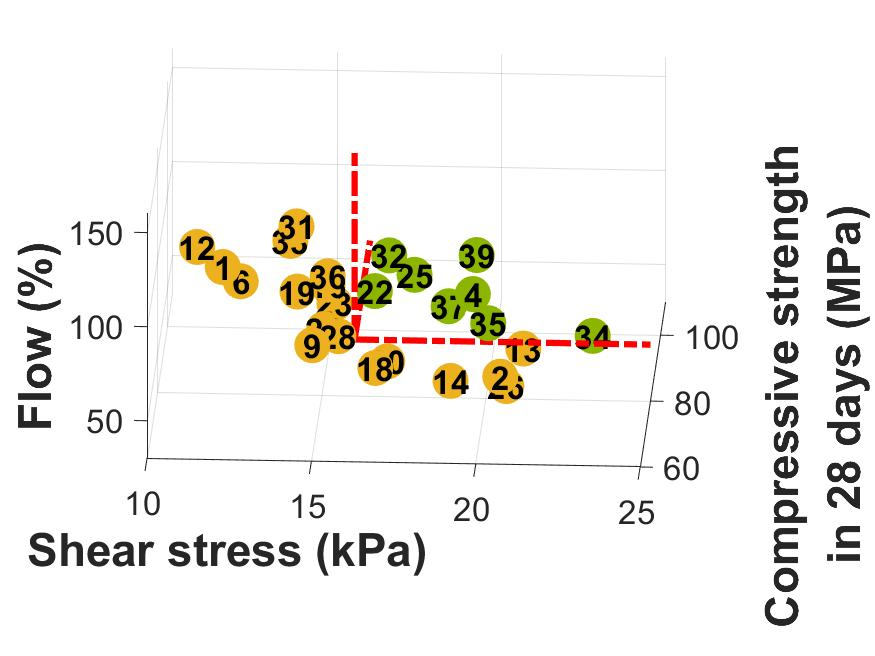

# Automating mix design for 3D concrete printing applications

The author of this code is Vasileios Sergis (vasileios.sergis.1@ens.etsmtl.ca) and the code was written as part of the Ph.D. at École de technologie supérieure, Université du Québec, directed by Professor Claudiane Ouellet-Plamondon (Claudiane.Ouellet-Plamondon@etsmtl.ca). The funding organizations acknowledged are Fonds de recherche du Québec – Nature et Technologies and the Canada Research Chair Program.

The files in this repository are the supporting information for the article: _Sergis, V. and C.M. Ouellet-Plamondon, Automating mix design for 3D printing applications using optimization methods. Digital Discovery 2022_

Please cite the article when using the files of this repository. 

*MATLAB version 9.9 (R2020b).

## Project description
The development of 3D printable cement-based materials is a complex process with a variety of competing objectives. The compositions formed are far more complex than in conventional concrete, increasing the difficulty in designing mixtures for 3D concrete printing. Aiming towards an optimal design has always been a challenge. In this study, optimization methods are employed to improve the properties of 18 cement-based mixtures obtained from a D-optimal mix design. The three targets are the improvement of the workability, buildability, and compressive strength. In total, three types of cement, three types of sand and five admixtures are investigated, including superplasticizers. Feedforward neural networks are used to predict the properties of new mixes. To evaluate the performance of the models, the normalized root mean square error and coefficient of determination are calculated. The genetic algorithm is employed to optimize the network hyperparameters, and the Pareto-optimization algorithm is used to simultaneously optimize the values of the three properties.

Workability, buildability and the compressive strength are the three investigated properties. The flow test, the direct shear test, and the compressive strength test are conducted. Acceptable mixes should have a flow above 60% in 5 minutes, shear stress above 16 kPa in 90 minutes, and a compressive strength above 80 MPa in 28 days after the end of the mixing process. The figure below, demonstrates the results obtained from the initial set of 18 mixes and the mixes obtained after 5 iterations of the proposed methodology.  
<h5 align="center">
Initial set &nbsp &nbsp &nbsp &nbsp &nbsp &nbsp &nbsp &nbsp &nbsp &nbsp &nbsp &nbsp &nbsp &nbsp &nbsp &nbsp &nbsp &nbsp &nbsp &nbsp &nbsp &nbsp &nbsp &nbsp &nbsp &nbsp &nbsp &nbsp &nbsp &nbsp 5th iteration
</h5>  

     

The [Data.xlsx](Training/Data.xlsx) file includes the data collected from the 18 D-optimal set of mixes, 16 mixes from a preliminary study, and the 21 mixes formed during the study. Fluctuations in the amount of water, sand or superplasticizer can extremely affect the flow measurement. For this reason, additional artificial data was added. The augmented data have the same combinations of materials as the mixes formed in the lab, but with the absence of water, sand, or superplasticizer. 

The methodology is divided into two main steps:
* Firstly, tuning the feedforward neural networks hyperparameters ([Tuning_hp.m](Training/Tuning_hp.m)) and training the models ([MLP_training.m](Training/MLP_training.m)). During the tuning of the hyperparameters, the aim is to find the right combination of their values to reduce the normalized root mean square error and increase the coefficient of determination ([objectivefunction_ga.m](Training/objectivefunction_ga.m)). Three models are trained in total, one for each property (flow, shear stress, compressive strength).
* Secondly, applying multiobjective Pareto optimization to generate new mixes to be formed with improved properties ([Pareto_optimization.m](Pareto_Optimization/Pareto_optimization.m)). The goals are to increase the buildability and the compressive strength while having adequate workability ([multiobjectives_pa.m](Pareto_Optimization/multiobjectives_pa.m)). Up to eight factors can be investigated, three qualitative and five quantitative factors. These include the types of cement or sand and the dosage or ratios of each factor. The hyperparameters of the algorithm are defined by the user based on the desired outcome. As an example, the user can select the ratio or the dosage range for each factor. The output of the Pareto optimization algorithm is a new set of mixes with optimized properties. All the solutions can be considered equally desirable and the user is responsible to select the most preferred ones.

This process was repeated five times during the study. From the new generated [set of mixes](Pareto_Optimization/New_mixes/), 2-5 mixes were selected at each iteration. The mixes were formed and tested in the laboratory. Finally, the results obtained were used in the next iteration to update the three [neural network models](Pareto_Optimization/Nets/).
